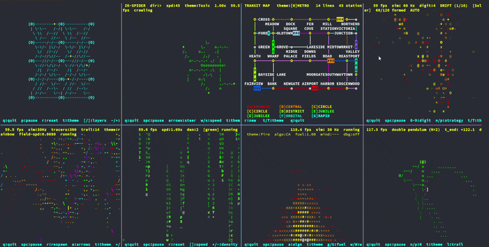
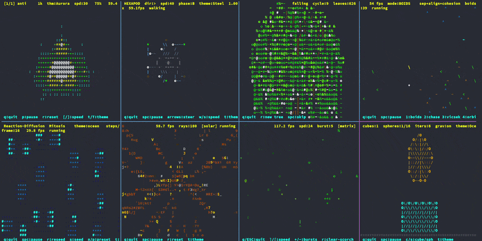
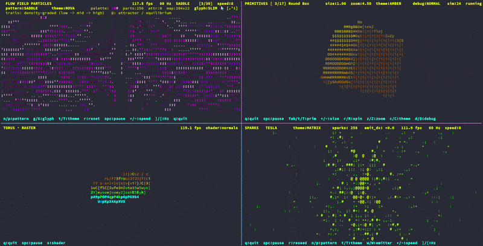

# ASCII Creative Coding

<p align="center">
  
  
  
</p>

**337 programs. Pure C. ncurses. No GUI. Each file complete in itself.**

---

## Overview

> *"It is in working within limits that the master reveals himself."* — Goethe
>
> *"The enemy of art is the absence of limitations."* — Orson Welles
>
> *"The more constraints one imposes, the more one frees oneself."* — Igor Stravinsky

The terminal is the constraint. A character grid, a handful of colors, no
graphics API to hide behind. Forcing a path tracer or a Navier-Stokes solver
through 80×24 cells leaves nowhere to bluff — you either understand the math
well enough to render it as text, or you don't. The restriction is what makes
the learning go deep.

---

## What This Is

A collection of real-time interactive simulations built entirely in C with
ncurses. Every program runs in a terminal window — no OpenGL, no SDL, no
graphics library. Forcing complex physics and rendering through a character
grid sharpens the understanding of every algorithm involved.

Topics span from elementary cellular automata to the Navier-Stokes equations.
From Conway's Game of Life to a Crank-Nicolson Schrödinger solver. From a
Bresenham wireframe to a full SDF raymarcher with Blinn-Phong shading to a
Cornell-box Monte Carlo path tracer.

**Build requirement:** `gcc`, `ncurses`, `libm`. Nothing else.

Per-program algorithm notes: [DEMOS.md](DEMOS.md). The `grids/` folder
carries its own [README](grids/README.md) covering the four tiling families
and their reading order.

---

## Design Choices

**Every file is self-contained — by intention, not by accident.**
I am not interested in building abstraction towers just to satisfy DRY and reuse dogma. Most “clean architecture” eventually becomes indirection layered on indirection until the actual problem disappears behind interfaces, helpers, and generic systems.

I want to understand the problem directly.

With AI assistance, rewriting code is cheaper than mentally unpacking five layers of abstraction written for hypothetical reuse. So math, state, update loop, and rendering stay together, readable top-to-bottom. Cause and effect remain adjacent. Even tiny helpers like clamp() or lerp() are often re-derived locally because hiding simple logic behind utility files actively hurts learning.

**Plain C — `struct`s and functions only.**
I know C++, Rust, Clojure, and Go. I reach for C anyway. For showcasing
an algorithm, nothing beats the elegance of having every step laid out
on the page and being free to change any of it. A struct and a function.
Edit a line, recompile in a second, see what happened. No abstraction
layer to peel back, no manual to consult — just the algorithm and me in
direct conversation. That is why I keep coming back.

The bigger reason is what C *carries* — the culture that grew up around
it, which I'm trying to inherit:

- **Demoscene energy** — the hardware-poking, push-the-pixels spirit that
  produced 64K intros and 4K megademos. Constraints as creative fuel.
- **UNIX philosophy** — one tool does one thing well. No framework between
  you and the bytes. One file, one program, pipe-able, hackable.
- **id Software-era experimentation** — Carmack-style "ship a demo, learn
  the math, write the renderer, repeat." See it on screen, throw it
  away, try the next thing.
- **Computational art notebook** — every file is a self-contained little
  experiment, like a page in a sketchbook. Copy, modify, riff.
- **"Learn by rebuilding everything yourself"** — no shared `clamp()`,
  no shared `lerp()`, no shared anything. You re-derive every primitive
  in the context it's used. The repetition IS the point.

These aren't features of the language. They're the spirit it carries.

**Copying is the intended workflow.**
```bash
gcc filename.c -lncurses -lm && ./a.out
```
That is the workflow. No build system, no CMake, no Makefile, no package
manager. A single file is a single program.

**POSIX terminal only.**
No Windows, no GUI. Forcing a Navier-Stokes solver or a path tracer through
a character grid demands a sharper understanding of the underlying math
than reaching for a graphics API would. The terminal is not a limitation —
it is the whole point.

**One physics model, one rendering model, applied uniformly.**
Every file uses the same fixed-timestep accumulator, the same pixel-space
coordinate model, and the same ncurses double-buffer sequence. Read one
file, you can read any other. The framework is not hidden — it's the first
thing documented in every source file. See [CLAUDE.md](CLAUDE.md) for the
full convention.

**Documentation as a first-class artefact.**
The goal is to expose the thinking behind the simulation, not just the
final output. Every file carries an overview, controls, build command,
and CONCEPTS / MENTAL MODEL blocks covering math, numerical method,
rendering pipeline, stability constraints, performance characteristics,
and historical lineage. Comments answer *why* the algorithm works and
how its equations map onto the terminal image — not API trivia.
References cite foundational papers, SIGGRAPH notes, numerical-analysis
texts, and classic graphics literature, so each program acts as a bridge
between research and executable code. The model is old demoscene source
releases and UNIX manpages: theory, implementation, and experimentation
in one place. The `documentation/` directory carries the long-form
essays that span across files.

**AI-assisted, human-directed.**
AI changed the workflow completely. Years of half-finished experiments,
abandoned prototypes, and postponed ideas finally became executable. The
collaborator that never got tired of debugging, explaining math, or
helping explore strange ideas at 2am turned a backlog into finished work.

The direction, taste, architecture, conventions, and educational structure
are mine. The acceleration and persistence came from collaboration with AI.

---

## Demos

Every program lives in a topic folder. Folders summarised here;
per-program algorithm notes in [DEMOS.md](DEMOS.md).

| Folder | Files | Summary |
|--------|------:|---------|
| `fluid/` | 11 | Stam stable fluids, FHP lattice gas, SPH, Gray-Scott reaction-diffusion, FitzHugh-Nagumo excitable medium, shallow-water & vorticity-streamfunction solvers, Perlin/complex flow fields, volumetric mushroom-cloud (`nuke`), CFL stability explorer |
| `physics/` | 33 | Lorenz / N-body / cloth / Ising / Schrödinger; Schwarzschild black hole; quaternion gyroscope; PBD chains & soft bodies; rigid-body stacks; Barnes-Hut O(N log N) gravity; D2Q9 lattice Boltzmann; bubble chamber, beam bending, stroke engine, gear, Chladni cymatics; CG / multigrid / RK-comparison solvers |
| `procedural/` | 82 | Six sub-folders: chaos (12), fields (13), fractals (17), generational (25), patterns (6), worldgen (9) — Mandelbrot/Julia/Buddhabrot/Newton, Barnsley IFS, DLA, Lyapunov, Apollonian, L-systems; Perlin/simplex/worley/value noise, curl-noise, SDF/JFA fields; Game of Life & rule variants, Langton, WFC, mazes (backtracker/Wilson), Wa-Tor, sandpile; Truchet/Wang/quasicrystal/Penrose tilings; star fields, galaxies, plate tectonics, hydraulic erosion, fBm clouds & cities |
| `grids/` | 76 | Four families (rect/hex/tri/polar) × *drawing* + *placement*. Triangular covers regular tilings (1–6), recursive fractals (7–9), aperiodic substitution (10, 12), and Delaunay (11). See [grids/README.md](grids/README.md) |
| `raster/` | 14 | Software rasteriser: cube/sphere/torus, displacement mesh, wireframe; deferred pipeline, shadow mapping, SSAO, bloom, neon edges; marching cubes, Mandelbulb raster, screen-space sun, the spinning ASCII donut |
| `raymarcher/` | 8 | Sphere tracing on SDFs: primitives, CSG atlas, blend/twist/repeat composition gallery, metaballs, KIFS fractal, Mandelbulb |
| `raytracing/` | 10 | Analytic ray↔primitive: sphere/cube/torus/capsule; tunnel, forest & window god rays, solar eclipse, ringed Saturn; Cornell-box Monte Carlo path tracer |
| `artistic/` | 23 | Aesthetic effects: galaxy, aurora, nebula, plasma, lava lamp; Hindu / Islamic geometric mandalas; volcano, fire tornado, hurricane, phoenix; dune rocket & sandworm; bonsai, jellyfish, DNA helix, leaf fall, sand art, LED / particle number-morph, railway transit map, ray swarm, bat colony |
| `animation/` | 14 | Forward & inverse kinematics (analytical 2-link + FABRIK); hexapod tripod gait, spider, scorpion; ragdoll figure & Verlet ropes; snake (FK & IK), centipede, tentacle forest |
| `flocking/` | 7 | Reynolds boids & 800-bird murmuration, shepherd herding, crowd steering, two-faction battle, digit-forming swarm, Physarum slime mould |
| `robots/` | 4 | Differential-drive robot, spring-leg pogo jumper, procedural biped walker, self-balancing Perlin-terrain bot |
| `algorithms/` | 11 | Quadtree / k-d / BSP trees; convex hull, Voronoi, visibility polygon; BFS/DFS/A\* graph search; sort visualiser; marching squares; SIR small-world epidemic |
| `geometry/` | 4 | Lissajous, spirograph, Maurer rose, Delaunay triangulation |
| `signal/` | 10 | Naive DFT / Cooley-Tukey FFT / IDFT, epicycle Fourier drawing & shapes, convolution, FIR filter design, aliasing/Nyquist, spectrogram |
| `particle_systems/` | 18 | Fire (3 algos) & aalib port, smoke, embers, sparks, fireworks, kaboom shockwave, burst, fountain, comet, rain, snow, falling sand, curl-noise & vortex fields, pixel-dissolve text, generic particle engine, constellation network |
| `matrix_rain/` | 5 | Classic Matrix rain + snowflake-accumulation, pulsar-beam, solar-corona, and fireworks-arc variants |
| `Ai/` | 2 | Genetic Smart Rockets, feed-forward neural-net visualiser |
| `turtle/` | 1 | Dual-turtle Logo-style polygon animator |
| `ncurses_basics/` | 4 | Framework reference: animation template, key generator, aspect-ratio & terminal-size probes |

---

## Build

```bash
# Universal pattern — same shape for every file in the repo:
gcc -std=c11 -O2 -Wall -Wextra <folder>/<file>.c -o <name> -lncurses -lm

# Examples:
gcc -std=c11 -O2 -Wall -Wextra fluid/navier_stokes.c           -o navier_stokes -lncurses -lm
gcc -std=c11 -O2 -Wall -Wextra physics/lorenz.c                -o lorenz        -lncurses -lm
gcc -std=c11 -O2 -Wall -Wextra procedural/fractals/mandelbrot.c -o mandelbrot   -lncurses -lm
gcc -std=c11 -O2 -Wall -Wextra raymarcher/raymarcher.c         -o raymarcher    -lncurses -lm
```

---

## Keys (Common)

Conventions shared across most demos. Not every program uses every key — each
one's bottom HUD line lists its exact controls.

| Key | Action |
|-----|--------|
| `q` / `ESC` | quit |
| `Space` | pause / resume (or trigger an event in effect demos) |
| `r` | reset / reseed |
| `+` / `-` | increase / decrease the primary parameter |
| `t` / `T` | cycle colour theme (forward / back) |
| `n` / `N` | cycle pattern / preset |
| `g` / `G` | cycle glyph set (pattern demos) |
| Arrow keys / `hjkl` | move or steer cursor / camera |
| `1`–`9` | jump directly to a preset or mode |

---

## Documentation

- [CLAUDE.md](CLAUDE.md) — full project conventions: section maps, comment
  standards, CONCEPTS / MENTAL MODEL block format, build rules
- [DEMOS.md](DEMOS.md) — per-program algorithm notes
- [documentation/Reference.md](documentation/Reference.md) — consolidated
  bibliography: every paper, book, and article cited across the source files,
  grouped by domain so each section doubles as a reading list
- [documentation/Framework.md](documentation/Framework.md) — line-by-line
  beginner's guide to the canonical animation framework
  (`ncurses_basics/framework.c`)
- [documentation/Visual.md](documentation/Visual.md) — ncurses field guide
- [documentation/COLOR.md](documentation/COLOR.md) — palettes, escape-time
  colouring, 256-colour patterns
- [grids/README.md](grids/README.md) — the four tiling families and their
  reading order (the one folder with its own walkthrough)

---

## Dependencies

- `gcc` (C11)
- `libncurses` (`sudo apt install libncurses5-dev` or equivalent)
- `libm` (standard)

Nothing else. No CMake, no package manager, no runtime dependencies.
